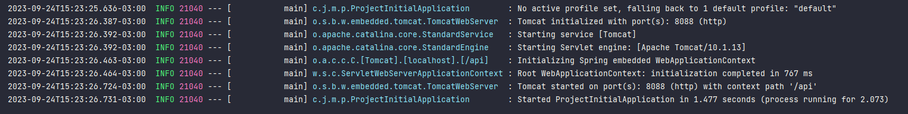

## Configuração inicial

1. Abrir o projeto na IDE, exemplo: IntelliJ
2. Build Project
3. Executar a aplicação (run)
4. Configurar o arquivo `application.properties`

* Vamos alterar a extensão, trocando `properties` por `yaml` ou `yml`
* Em seguida, vamos incluir algumas configurações no `application.yaml`

```yaml
server:
  # Trocamos a porta padrão 8080 para 8088 (http://localhost:8088)
  port: 8088
  # Incluímos um path na URL: (http://localhost:8088/api)
  servlet:
    context-path: /api

spring:
  application:
    # Nome da aplicação
    name: project-initial
```

Observe que a porta e o `context-path` foram alterados:

* Imagem do Console


