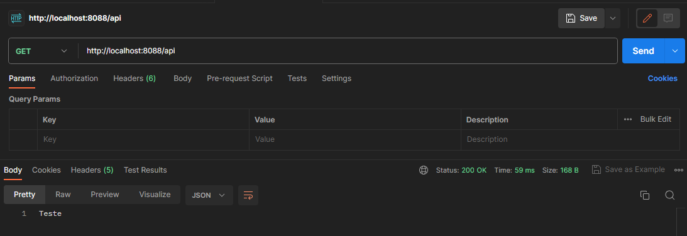

# Java Programming  

Agora vamos incluir o controlador.  

1. Criar uma pasta chamada `controller`  
2. Criar uma classe java chamada `UsuarioController`  
3. Criar um método que retorna uma `string`  
4. Na classe incluir as anotações `@RestController` e `@RequestMapping`   
5. No método `teste` incluir a anotação `@GetMapping`  

```java
package com.juhmaran.myproject.projectinitial.controller;

import org.springframework.web.bind.annotation.GetMapping;
import org.springframework.web.bind.annotation.RequestMapping;
import org.springframework.web.bind.annotation.RestController;

@RestController
@RequestMapping
public class UsuarioController {

    @GetMapping
    public String teste() {
        return "Teste";
    }

}
```

6. Executar a aplicação  
7. Testar a chamada utilizando a ferramenta 'Postman' ou outra de sua preferência   

- Exemplo de cURL:  

```cURL
curl --location 'http://localhost:8088/api'
```

- Exemplo de retorno:  

```json
Teste
```

- Evidência: 

