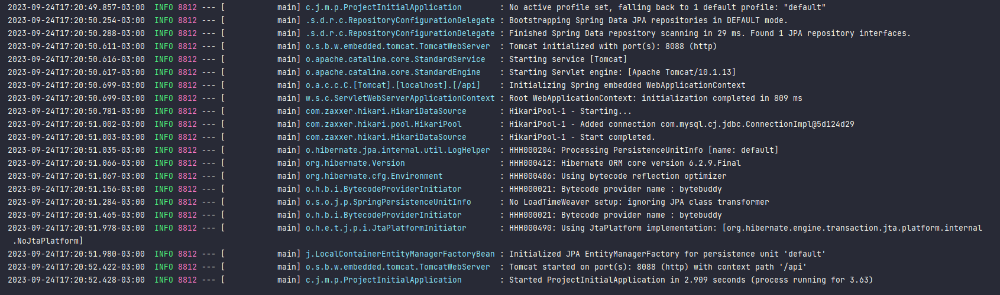

# Java Programming  

> Repository, Entity, Configurar o `application.yaml` e Adicionar dependências no `pom.xml`    

1. Criar uma pasta chamada `repository`  
2. Criar uma interface java chamada [`UsuarioRepository`](./project-initial/src/main/java/com/juhmaran/myproject/projectinitial/repository/UsuarioRepository.java)   
3. Adicionar dependência JPA e MySQL para conectar com o Banco de Dados SQL  

4. [Dependências adicionadas](./project-initial/pom.xml):  

- **Spring Data JPA**: serve para persistir dados em bancos de dados SQL utilizando API Java Persistence API, Spring Data e Hibernate.   
- **MySQL Connector/J**: fornece um driver JDBC para conectar-se ao banco de dados MySQL.   
- **Spring Boot Starter Validation**: valida os dados usando Java Bean Validation com Hibernate Validator.   
- **Spring Configuration Processor**: Uma dependência que gera metadados para oferecer aos desenvolvedores ajuda contextual e "code completion" ao trabalhar com chaves de configuração personalizadas (ex.: application.properties/.yml). Isto é, podemos obter ajuda contextual e "code completion" ao trabalhar com chaves de configuração personalizadas.  

5. Após adicionar as dependências para persistir dados e conectar com o banco de dados, é necessário configurar o [`application.yaml`](./project-initial/src/main/resources/application.yaml).  

6. Testar conexão com o banco de dados.  

7. Criar um pacote `entities` e uma classe [`UsuarioEntity`](./project-initial/src/main/java/com/juhmaran/myproject/projectinitial/entities/UsuarioEntity.java) para armazenar os dados no banco de dados  
8. Criar [`script SQL`](./project-initial/src/main/resources/static/script.sql) para criar o banco de dados e a tabela.   
